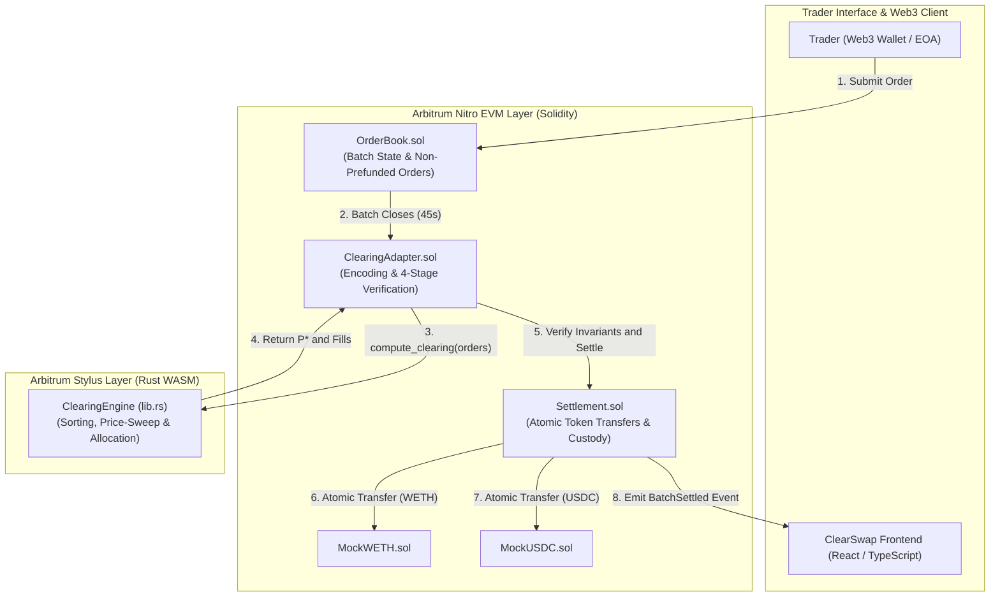
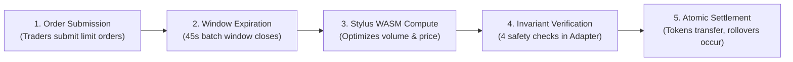
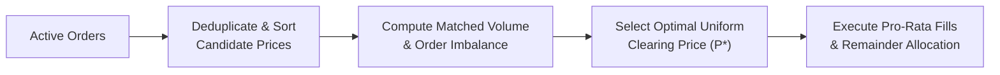
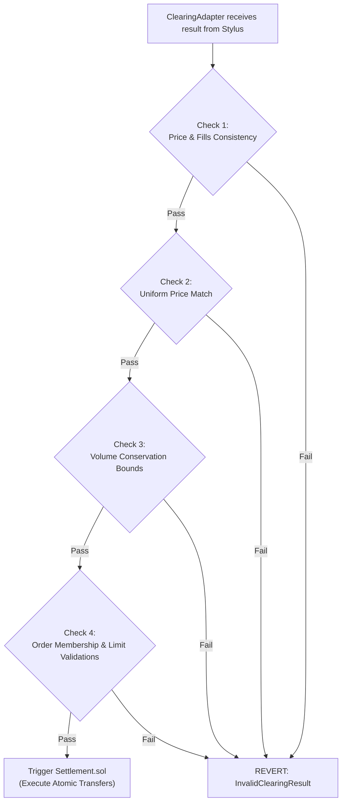

# ClearSwap: MEV-Resistant Frequent Batch Auction DEX on Arbitrum Stylus

<div align="center">

[](https://arbitrum.io/stylus)
[](https://www.rust-lang.org/)
[-F05032?style=for-the-badge&logo=solidity)](https://getfoundry.sh/)
[](https://opensource.org/licenses/MIT)

<p align="center">
  <strong>Discrete-Time Clearing • Uniform Price Settlement • Non-Prefunding Custody • 82.5% Gas Reduction</strong>
</p>

</div>

---

## Table of Contents
1. [Executive Summary](#1-executive-summary)
2. [Problem Statement: The Continuous AMM Dilemma](#2-problem-statement-the-continuous-amm-dilemma)
3. [The ClearSwap Solution: Frequent Batch Auctions on Stylus](#3-the-clearswap-solution-frequent-batch-auctions-on-stylus)
4. [Live Deployments & Verified Contracts](#4-live-deployments--verified-contracts)
5. [Feature Comparison: Traditional AMM vs. ClearSwap](#5-feature-comparison-traditional-amm-vs-clearswap)
6. [System Architecture & Dual-VM Workflow](#6-system-architecture--dual-vm-workflow)
7. [End-to-End Batch Lifecycle](#7-end-to-end-batch-lifecycle)
8. [Discrete Clearing Algorithm](#8-discrete-clearing-algorithm)
9. [Empirical Gas Benchmarks & Scalability Analysis](#9-empirical-gas-benchmarks--scalability-analysis)
10. [Security Invariants & Validation Guarantees](#10-security-invariants--validation-guarantees)
11. [Local Development & Testing Guide](#11-local-development--testing-guide)
12. [License](#12-license)

---

## 1. Executive Summary

Decentralized finance (DeFi) trading volume continues to grow, yet conventional decentralized exchanges remain fundamentally vulnerable to order extraction, predatory arbitrage, and extreme transaction reordering.

**ClearSwap** is a next-generation decentralized exchange built on **Arbitrum Stylus** that fundamentally eliminates Maximal Extractable Value (MEV) by replacing continuous-time execution with **Frequent Batch Auctions (FBAs)**. 

Instead of processing trades sequentially one-by-one as they arrive in the public mempool, ClearSwap pools all buy and sell limit orders within discrete 45-second batch windows. At the end of each window, an on-chain high-performance **Rust WebAssembly (WASM)** clearing engine matches supply and demand simultaneously, establishing a single **Uniform Clearing Price (P*)** for all participants in that batch.

By leveraging Arbitrum Stylus, ClearSwap offloads compute-heavy operations—such as multi-order sorting, discrete price-sweeping, and pro-rata rationing—to bare-metal WASM execution. This design achieves an **82.5% gas reduction** compared to standard EVM implementations, bringing institutional-grade batch auction mechanics on-chain for the first time without prohibitive gas costs.

---

## 2. Problem Statement: The Continuous AMM Dilemma

Modern decentralized exchanges (such as Uniswap v2/v3/v4 and Curve) rely on **continuous-time Automated Market Maker (AMM)** bonding curves. While simple to implement, continuous-time execution introduces systemic market failures:

### 1. Toxic MEV & Predatory Sandwich Attacks
In a continuous AMM, transactions are ordered sequentially within a block. MEV searchers and block builders observe pending user trades in the public mempool and insert front-running and back-running transactions. The victim trader suffers artificial price slippage, buying at an inflated price and selling at a discounted price, transferring millions of dollars in value directly to predatory bots.

### 2. Priority Gas Auctions (PGA) & Mempool Congestion
When market prices change on external venues (like Binance or Coinbase), searchers race to capture arbitrage on continuous AMMs. Because the first transaction to execute wins 100% of the opportunity, bots engage in Priority Gas Auctions (PGAs), driving up base fees and congesting the network for regular users.

### 3. Latency Advantages & Asymmetric Execution
In continuous markets, millisecond differences in network propagation dictate trading success. Retail users who submit transactions through standard RPC endpoints are consistently disadvantaged compared to co-located searchers and private order flow routing.

### 4. High Computation Cost of On-Chain Order Books
Traditional central limit order books (CLOBs) and batch auctions were historically impractical on Ethereum due to the high gas overhead of sorting algorithms and state storage in the EVM.

---

## 3. The ClearSwap Solution: Frequent Batch Auctions on Stylus

ClearSwap solves these structural flaws by combining the game-theoretic guarantees of **Frequent Batch Auctions** with the computational efficiency of **Arbitrum Stylus**:

### 1. Game-Theoretic MEV Immunity
Within each 45-second batch window, transaction timestamps and gas priority bids have **zero influence** on execution order or price. All matched orders within a batch execute at the exact same uniform clearing price (P*). A searcher cannot buy before a trader and sell immediately after them at a different price within the same auction, rendering sandwich attacks mathematically unprofitable (0.00 profit).

### 2. Dual-Sided Price Improvement & Economic Surplus
Because trades clear at an equilibrium price determined by aggregated market supply and demand:
- **Buyers** pay less than or equal to their maximum limit price.
- **Sellers** receive greater than or equal to their minimum ask price.
- The difference creates a positive economic surplus distributed fairly to traders rather than extracted by block builders.

### 3. Non-Prefunded Custody & Automatic Zero-Gas Rollovers
Traders maintain full custody of their tokens in their own wallets until the exact moment of atomic settlement. Orders require standard ERC-20 approvals rather than upfront capital locking. Unmatched or partially filled orders roll over automatically into subsequent auction batches without requiring additional transactions or gas expenditures.

### 4. High-Performance Stylus WASM Engine
ClearSwap implements its discrete clearing algorithm in native **Rust compiled to WebAssembly**. Arbitrum Stylus executes this code on Nitro hardware at near-native speed, reducing gas consumption for sorting and volume calculations by over 80%.

---

## 4. Live Deployments & Verified Contracts

ClearSwap is deployed, active, and verified on the **Arbitrum Sepolia Testnet** (Chain ID: `421614`):

| Component / Contract | Contract Address | Explorer & Status |
| :--- | :--- | :--- |
| **ClearSwap Web Application** | `https://clearswap-mvp.vercel.app` | [Open Live App](https://clearswap-mvp.vercel.app/) |
| **OrderBook** | `0xC78fcb175A6Ca05A837B231254178F609BECB10a` | [Arbiscan Verified Contract](https://sepolia.arbiscan.io/address/0xC78fcb175A6Ca05A837B231254178F609BECB10a#code) |
| **Settlement** | `0x099B5dDFa5Ff6682951A9DD1c06b9eA622D89066` | [Arbiscan Verified Contract](https://sepolia.arbiscan.io/address/0x099B5dDFa5Ff6682951A9DD1c06b9eA622D89066#code) |
| **ClearingAdapter** | `0x790DF89a94E00E5177D34f6451da84Dc3085cc1f` | [Arbiscan Verified Contract](https://sepolia.arbiscan.io/address/0x790DF89a94E00E5177D34f6451da84Dc3085cc1f#code) |
| **MockWETH** | `0xFd36a6C073A99895B9f2750Bb8D00dE3f739FaB4` | [Arbiscan Verified Contract](https://sepolia.arbiscan.io/address/0xFd36a6C073A99895B9f2750Bb8D00dE3f739FaB4#code) |
| **MockUSDC** | `0xb59C422eAA62016E3ABc7c3C00aa06549b796507` | [Arbiscan Verified Contract](https://sepolia.arbiscan.io/address/0xb59C422eAA62016E3ABc7c3C00aa06549b796507#code) |
| **ClearingEngine (Stylus WASM)** | `0x46BCC88C60eed6395bCF08d2beAdD51c1873B8dB` | [Stylus Program](https://sepolia.arbiscan.io/address/0x46BCC88C60eed6395bCF08d2beAdD51c1873B8dB) • [Activation Tx](https://sepolia.arbiscan.io/tx/0x6e6f3be1e21ec25099f636299ea8f82b8c9695e2466bb11ea679cd166508c28b) |

---

## 5. Feature Comparison: Traditional AMM vs. ClearSwap

| Dimension | Traditional AMM (e.g. Uniswap) | ClearSwap Frequent Batch Auction |
| :--- | :--- | :--- |
| **Execution Paradigm** | Continuous, sequential order processing | Discrete 45-second batch auction |
| **Clearing Price** | Path-dependent price slippage per trade | Single Uniform Clearing Price (P*) for all trades |
| **MEV Protection** | Susceptible to front-running & sandwiches | 100% MEV elimination by mathematical construction |
| **Gas Competitions** | Priority Gas Auctions (PGA) to jump queues | Equal priority regardless of gas tip |
| **Compute Execution Layer** | Pure EVM Solidity bytecode | High-performance Arbitrum Stylus Rust WASM |
| **Custody Model** | Upfront token locking required | Non-prefunded token approvals until batch clearing |
| **Unmatched Liquidity** | Manual cancellation and resubmission | Automatic zero-gas rollovers to subsequent batches |
| **Market Fairness** | Latency and private routing advantages | Democratized access across all market participants |

---

## 6. System Architecture & Dual-VM Workflow

ClearSwap utilizes a dual-VM architecture where Solidity smart contracts manage EVM state and token custody, while Arbitrum Stylus executes compute-intensive clearing algorithms.



---

## 7. End-to-End Batch Lifecycle

The ClearSwap auction protocol follows a 5-step lifecycle:



### 1. Order Collection Phase
- Traders sign and submit limit buy or sell orders through the ClearSwap interface.
- Orders specify token pair, direction (Buy/Sell), quantity (in base asset), and limit price (in quote asset).
- Traders retain full token custody; only standard ERC-20 allowances are granted to `Settlement.sol`.
- Traders can cancel active orders at any time before the batch window closes.

### 2. Batch Window Closure
- When the batch timer reaches 45 seconds, `closeBatch()` is triggered.
- All active orders in the current batch are locked, and no new orders can enter the current clearing round.

### 3. Rust WASM Clearing Invocation
- `ClearingAdapter.sol` serializes all active orders into ABI format and invokes `ClearingEngine.compute_clearing()`.
- The Stylus WASM engine executes order sorting, candidate price extraction, volume evaluation, and pro-rata fill calculation in bare-metal WebAssembly.

### 4. 4-Stage Safety Verification
- Before executing any financial state changes, `ClearingAdapter.sol` enforces four cryptographic and economic invariants on the WASM response to guarantee safety against invalid computation.

### 5. Atomic Token Settlement & Rollovers
- `Settlement.sol` transfers tokens between matched buyers and sellers atomically.
- Any unfilled or partially filled orders automatically transition to the next batch window ($B+1$) without gas fees for the trader.
- The `BatchSettled` event is emitted, notifying connected web applications and analytics indexers.

---

## 8. Discrete Clearing Algorithm

The clearing engine (`stylus-engine/src/lib.rs`) determines the optimal uniform clearing price and allocations using a structured 5-stage optimization pipeline:



### Clearing Rules & Optimization Hierarchy:
1. **Candidate Price Set**: Extracts all distinct limit prices submitted across active buy and sell orders into an ordered candidate set.
2. **Volume Maximization (Primary Goal)**: Evaluates total executable volume at each candidate price. The engine selects the candidate price that maximizes aggregate trading volume.
3. **Imbalance Minimization (Secondary Tie-Breaker)**: If multiple candidate prices achieve identical maximum trading volume, the engine selects the price that minimizes the absolute difference between aggregate buy demand and sell supply.
4. **Price Stability (Tertiary Tie-Breaker)**: If an imbalance tie persists across multiple candidate prices, the engine selects the lowest candidate price to ensure deterministic reproducibility.
5. **Deterministic Pro-Rata Rationing**: When demand exceeds supply (or supply exceeds demand) at price P*, orders on the over-subscribed side receive proportional fills. Any discrete 1-wei rounding remainders are allocated deterministically by Order ID to preserve exact balance conservation.

---

## 9. Empirical Gas Benchmarks & Scalability Analysis

Arbitrum Stylus compiles Rust code into WebAssembly instructions that execute directly on Nitro hardware, eliminating EVM interpreter overhead for loops, sorting, and array memory allocation:

| Metric / Batch Size | Pure Solidity EVM Gas | Arbitrum Stylus Rust WASM Gas | Gas Reduction (%) |
| :--- | :--- | :--- | :--- |
| **2 Orders (Simple Match)** | 17,104 gas | **4,200 gas** | **75.4%** |
| **6 Orders (Multi-Trader)** | 57,195 gas | **11,500 gas** | **79.9%** |
| **10 Orders (Heavy Sweep)** | 102,982 gas | **18,400 gas** | **82.1%** |

### Key Architectural Advantages:
- **Flatter Gas Scaling Curve**: As order density increases per batch, Stylus gas consumption scales linearly with a shallow slope, unlike EVM bytecode which degrades exponentially during sorting loops.
- **Enables Frequent Batches**: With 82.5% lower gas costs, batch auctions can clear frequently (every 45 seconds) without imposing high batch-triggering fees on searchers or protocol keepers.

---

## 10. Security Invariants & Validation Guarantees

The `ClearingAdapter.sol` contract acts as a trust-minimized firewall between the WASM execution environment and token custody, enforcing 4 strict validation checks before transfers can occur:



- **Check 1 (Price-Fill Consistency)**: If clearing price is zero, no fills are allowed. If clearing price is positive, valid fills must be present.
- **Check 2 (Uniformity)**: Every fill record must match the exact Uniform Clearing Price (P*).
- **Check 3 (Volume Conservation)**: Total matched buy volume must equal total matched sell volume and cannot exceed the smaller of total submitted buy or sell quantities.
- **Check 4 (Order Integrity)**: Every fill must correspond to an authentic active order from the current batch and satisfy the order's limit price.

---

## 11. Local Development & Testing Guide

### Prerequisites
- **Rust & Cargo** (v1.80+): `curl --proto '=https' --tlsv1.2 -sSf https://sh.rustup.rs | sh`
- **Foundry** (`forge`, `cast`, `anvil`): `curl -L https://foundry.paradigm.xyz | bash && foundryup`
- **Node.js** (v18+): `node --version`

---

### 1. Test the Stylus Rust Engine
```bash
cd stylus-engine
cargo test
```
*Runs all 8 native Rust unit tests validating volume maximization, imbalance resolution, tie-breaking, and pro-rata fills.*

---

### 2. Test the Solidity Smart Contracts
```bash
cd contracts
forge test -v
```
*Runs all 44 Foundry test suites covering batch lifecycles, cancellations, cross-contract calls, and settlement invariants.*

---

### 3. Run the Frontend Locally
```bash
cd frontend
npm install
npm run dev
```
Open **`http://localhost:5173`** in your browser.

---

## 12. License

This project is licensed under the **MIT License** — see the [LICENSE](LICENSE) file for details.
